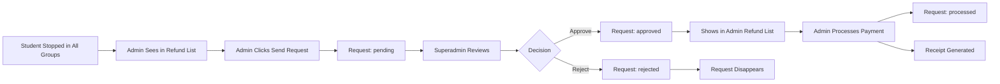

# 🎯 Enhanced Refund & Debt Management with Approval Workflow

## 🚀 **What's New - Complete Implementation**

The system now includes a **comprehensive refund approval workflow** with superadmin oversight, while keeping debt processing direct for efficiency.

## 📋 **Complete Workflow Overview**

### **1. For Refunds (Requires Approval)**
```
Student Stopped → Admin Reviews → Sends Request → Superadmin Approves → Admin Processes → Receipt Generated
```

### **2. For Debts (Direct Processing)**
```
Student Stopped → Admin Reviews → Processes Payment → Receipt Generated
```

## 🎯 **Key Features Implemented**

### ✅ **1. Enhanced Refund Display**
- **Stopped Groups with Reasons**: Shows which groups student was stopped in and why
- **Approval Status Indicators**: Visual distinction between eligible students and approved requests
- **Comprehensive Student Info**: Custom ID, balance, and detailed group information

### ✅ **2. Refund Request System**
- **Request Creation**: Admin sends refund request to superadmin instead of direct processing
- **Database Storage**: All requests stored in `refund_requests` table with complete audit trail
- **Automatic Status Management**: Prevents duplicate requests for same student

### ✅ **3. Superadmin Approval Dashboard**
- **Dedicated Section**: New section in superuser page for refund approvals
- **Request Details Modal**: Complete view of student info, stopped groups, and reasons
- **Approval/Rejection**: Superadmin can approve or reject with notes
- **Status Tracking**: Real-time status updates (pending → approved/rejected)

### ✅ **4. Payment Processing Integration**
- **Dual Button Logic**: Different buttons for requests vs approved refunds
- **Automatic Receipt Generation**: Uses existing `processRefund` function
- **Status Updates**: Marks requests as 'processed' after payment
- **Audit Trail**: Complete record of who approved what and when

## 🛠️ **Technical Implementation**

### **Database Schema**
```sql
-- refund_requests table
CREATE TABLE refund_requests (
    id UUID PRIMARY KEY,
    student_id UUID NOT NULL,
    student_name TEXT NOT NULL,
    student_custom_id TEXT,
    requested_amount DECIMAL(10,2) NOT NULL,
    reason TEXT NOT NULL,
    stopped_groups JSONB NOT NULL,
    admin_name TEXT NOT NULL DEFAULT 'Admin',
    status TEXT NOT NULL DEFAULT 'pending', -- pending, approved, rejected, processed
    superadmin_notes TEXT,
    created_at TIMESTAMP WITH TIME ZONE DEFAULT NOW(),
    updated_at TIMESTAMP WITH TIME ZONE DEFAULT NOW(),
    approved_at TIMESTAMP WITH TIME ZONE,
    approved_by TEXT
);
```

### **Frontend Components**

#### **Enhanced Payments Page (`src/app/payments/page.tsx`)**
```typescript
// Shows both eligible students and approved requests
loadRefundList() {
    const [refunds, approvedRequests] = await Promise.all([
        getRefundList(),           // Eligible students (no pending requests)
        loadApprovedRefundRequests() // Approved requests ready for processing
    ]);
}

// Different handling based on request status
handleClick = selectedStudent.isApprovedRequest ? 
    handleProcessApprovedRefund :  // Direct payment processing
    handleSendRefundRequest;       // Send to superadmin
```

#### **Superadmin Dashboard (`src/app/superuser/page.tsx`)**
```typescript
// New RefundRequestsSection component
function RefundRequestsSection() {
    const [refundRequests, setRefundRequests] = useState([]);
    
    // Approval/rejection with notes
    handleApproveRequest(requestId) { /* Update status to 'approved' */ }
    handleRejectRequest(requestId)  { /* Update status to 'rejected' */ }
}
```

### **Backend Integration**

#### **Updated Refund Service (`src/lib/supabase-service.ts`)**
```typescript
async getRefundList() {
    // Excludes students with pending refund requests
    const existingRequest = await supabase
        .from('refund_requests')
        .select('id')
        .eq('student_id', studentId)
        .eq('status', 'pending');
        
    if (existingRequest.length > 0) {
        continue; // Skip students with pending requests
    }
}
```

## 🎭 **User Experience Flow**

### **👨‍💼 Admin Experience**

1. **View Refund List**:
   ```
   💰 Payments Page → Refund Button → See two types:
   📋 Eligible Students (Red) - Need approval
   ✅ Approved Requests (Green) - Ready to process
   ```

2. **For Eligible Students**:
   ```
   📋 Click student → See stopped groups & reasons → Enter amount → 
   📤 "Send Refund Request to Superadmin" → Request sent → Student removed from list
   ```

3. **For Approved Requests**:
   ```
   ✅ Click approved student → See approval details → Enter amount → 
   💰 "Process Approved Refund" → Payment processed → Receipt generated
   ```

### **👑 Superadmin Experience**

1. **Review Requests**:
   ```
   🏛️ Superuser Dashboard → "Refund Requests (X pending)" section → 
   📊 Table with all requests → "View Details" button
   ```

2. **Approval Process**:
   ```
   📋 Modal opens → Student info + stopped groups + admin reason → 
   📝 Add notes → ✅ Approve or ❌ Reject → Request status updated
   ```

3. **Monitoring**:
   ```
   📈 See all historical requests → Filter by status → 
   🔍 Track what was approved/rejected and by whom
   ```

## 📊 **Status Workflow**



## 🛡️ **Security & Audit Features**

### **Approval Controls**
- ✅ **Dual Authorization**: Admin requests, Superadmin approves
- ✅ **Notes Required**: Superadmin must provide reason for rejection
- ✅ **Status Tracking**: Complete audit trail of all actions
- ✅ **Duplicate Prevention**: Can't request same student twice

### **Payment Controls**
- ✅ **Amount Validation**: Admin can modify amount before processing
- ✅ **Receipt Generation**: Automatic receipt with approval notes
- ✅ **Database Updates**: Marks request as processed after payment
- ✅ **Error Handling**: Robust error handling for failed payments

## 📈 **Business Benefits**

### **For School Administration**
1. **Control**: Superadmin oversight prevents unauthorized refunds
2. **Transparency**: Complete audit trail of all refund decisions
3. **Efficiency**: Streamlined process with clear status indicators
4. **Compliance**: Documented approval process for financial records

### **For Daily Operations**
1. **Clear Workflow**: Admins know exactly what to do for each case
2. **Visual Clarity**: Different colors and icons for different statuses
3. **Reduced Errors**: Automatic status management prevents confusion
4. **Quick Processing**: Approved refunds can be processed immediately

## 🧪 **Testing the Complete Workflow**

### **Test Scenario 1: Full Refund Approval**
```
1. Stop student in all groups (attendance page)
2. Go to payments → Refund → Click student → Send request
3. Go to superuser dashboard → Review request → Approve
4. Back to payments → Refund → Process approved refund
5. Verify: Receipt generated, student removed from list
```

### **Test Scenario 2: Refund Rejection**
```
1. Send refund request (steps 1-2 above)
2. Superadmin rejects with reason
3. Verify: Request disappears, student not in refund list
```

### **Test Scenario 3: Debt Processing (Unchanged)**
```
1. Stop student in all groups with negative balance
2. Go to payments → Debt → Process payment directly
3. Verify: Receipt generated, normal flow unchanged
```

## 🎯 **Key Improvements Summary**

| Feature | Before | After |
|---------|--------|-------|
| **Refund Process** | Direct processing | Approval workflow |
| **Visibility** | Basic student info | Stopped groups + reasons |
| **Security** | Admin-only | Dual authorization |
| **Audit Trail** | Payment records only | Complete request history |
| **User Experience** | Single flow | Context-aware buttons |
| **Status Management** | Manual tracking | Automatic status updates |

## 🚀 **Ready for Production**

✅ **Database Migration**: Run `refund-requests-migration.sql`  
✅ **Frontend Complete**: All UI components implemented  
✅ **Backend Integration**: All services updated  
✅ **Error Handling**: Robust error management  
✅ **Type Safety**: Complete TypeScript integration  
✅ **User Experience**: Intuitive workflow design  

**The enhanced refund approval workflow is now fully implemented and ready for production use!** 🎉
